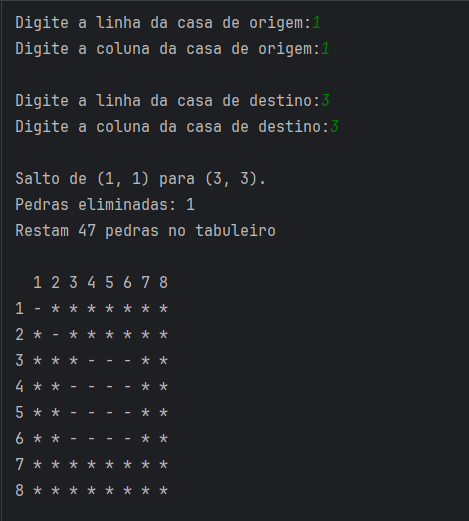

# Jogo das Pedras
## Rules 📃
A jump always involves moving a piece to an empty square. The destination square for the piece in the jump must be diagonally across from its starting square. To reach the empty square, the piece cannot move through other empty squares.

## Difficulties 💀
 -   **Very Easy**: Remove up to 29 stones.
-   **Easy**: Remove between 30 and 39 stones.
-   **Hard**: Remove between 40 and 44 stones.
-   **Very Hard**: Remove between 45 and 47 stones.

## Game menu
The menu consists of a logical layout with 3 options:

1.  **New Game**
2.  **Rules**
3.  **About (Creator information's)**

## Board
An 8x8 board is generated as an array represented by `matrix[8][8]`. 
 - Stones [*]
 - Empty spots [-]

 
 ## Movements
The first two inputs (x, y) must correspond to a stone on the board that will be moved to the second set of coordinates (x, y), which must be a valid move to an empty space.

When a move is made, the user is shown the details of the move executed, the number of stones removed, and the number of stones remaining on the board.

